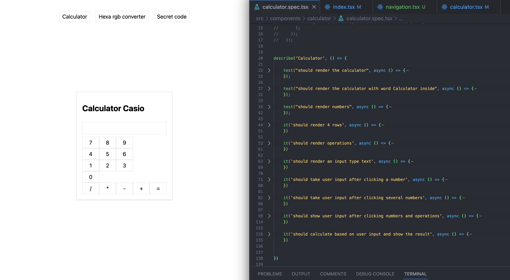

<div align="center">



# 💪 Qwik & Vitest: practicando

</div>

## Cómo funciona

Como ya sabéis, la idea es escribir los unit test antes/mientras estás haciendo el componente, y hacer que vaya pasando distintos tests para intentar abarcar todos los posibles casos de uso posibles. En este repo tengo varios ejercicios en los que vemos cómo hacer unit test de algunos componentes.

- ➕ [Calculadora](/src/components/calculator/calculator.spec.tsx)
- 🖍️ [Hexa to RGB Converter - In Progress](/src/components/hexa-to-rgb-converter/hexa-to-rgb-converter.spec.tsx)
- 🕵️‍♂️ [Secret Code](/src/components/secret-code/secret-code.spec.tsx)
- 📅 [Calendary](/src/components/calendar/calendar.spec.tsx)

## Usar el test environment

Tenemos un montón de scripts en el `package.json` para probar el testing de qwik con vitest. En lo personal me he encontrado que da un poco de fallo todavía (cuando actualizas el componente, los tests se quedan con el resultado anterior y hace falta interrumpir el test y volverlo a correr), pero el comando `test.unit` debería funcionar para lo que queremos hacer. Para mirar el porcentaje cubierto con todos los tests, podemos correr `vitest run --coverage`. Así que para empezar con el repo puedes hacer lo siguiente después de clonar / fork el repo.

- `npm i`
- `npm run dev`
- `npm run test.unit`

## Métodos de los tests con vitest

Vamos a estar utilizando una serie de métodos de `@builder.io/qwik/testing` y de `vitest` para poder hacer unit testing con Qwik. Con el primero, vamos a crear un DOM artificial en el que renderizar nuestros componentes gracias al `render` o simular el document gracias a `screen`, y con vitest vamos a estar utilizando los siguientes métodos:

- **describe**: inicia una colección o agrupación de tests. Por ejemplo, podemos empezar todos los tests referentes a un componente con un describe.

- **test**: inicia el test que será revisado. También puedes utilizar como alias las palabras `bench` o `it`.

- **expect**: aquí es dónde escribiremos cuál es el resultado que esperamos de nuestro test.

Veamos un ejemplo:

```tsx
describe('Calculator', () => {

    test("should render the calculator", async () => {
        const { render } = await createDOM();
        await render(<Calculator />);
    });

    test("should render the calculator with word Calculator inside", async () => {
        const { screen, render } = await createDOM();
        await render(<Calculator />);
        const calculator = screen.querySelector('.calculator') as HTMLElement;
        expect(calculator.outerHTML).toContain('Calculator');
    });
}
```

Una cosa característica de Qwik con respecto a hacer testing con React por ejemplo, es que aquí utilizamos `async` en la declaración del test y `await` más tarde en determinadas funciones, como `render`.

Para más información, échale un vistazo a la documentación de [vitest](https://vitest.dev/guide/).
